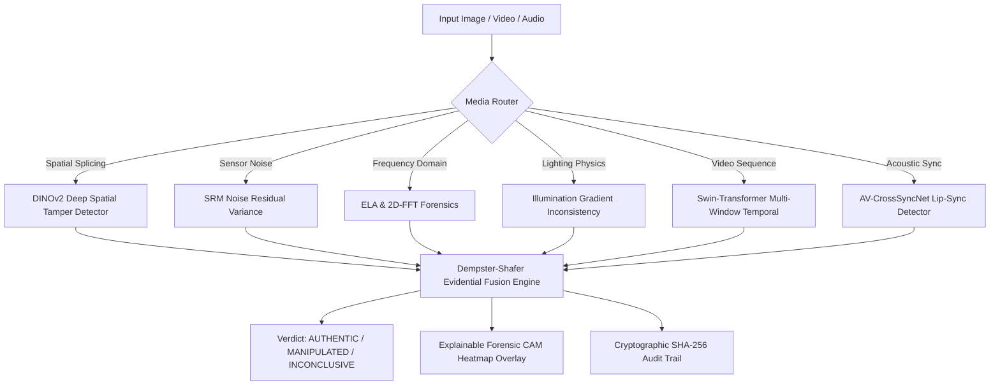

# TruthLens: Unified Multi-Signal Deepfake Forensic Platform

[-EE4C2C.svg)](https://pytorch.org/)
[](https://fastapi.tiangolo.com/)
[](LICENSE)
[](https://developer.nvidia.com/cuda-zone)

> **TruthLens** is an end-to-end AI digital forensics platform engineered for high-accuracy deepfake detection, spatial splicing localization, temporal discontinuity tracking, and acoustic-visual lip-sync verification.

---

## 🎯 Architecture Overview

TruthLens operates across multiple forensic dimensions to detect manipulated media and explain *where* and *why* tampering occurred:



### Forensic Modules

| Modality | Architecture | Key Forensic Signature Detected | Checkpoint | Precision |
| :--- | :--- | :--- | :--- | :--- |
| **Spatial Visual** | `TruthLensDinov2Net` | AI boundary artifacts, GAN/Diffusion blend seams, Patch CAM | `truthlens_dinov2_model.pth` | **FP32** |
| **Sensor Noise** | Steganalysis Filter Bank | PRNU (Photo-Response Non-Uniformity) variance mismatch | Rule-based SRM | **FP32** |
| **Frequency / ELA** | 2D-FFT & DCT Compression | Double compression, re-quantization anomalies | Algorithmic | **FP32** |
| **Lighting Physics** | Illumination Estimator | 3D lighting vector discrepancy across subjects | Physics-based | **FP32** |
| **Temporal Video** | Swin-Transformer Sequence | Inter-frame facial flickering, identity warp, micro-expression jitter | `best_calibrated_model.pth` | **FP32** |
| **Audio-Visual** | AV-CrossSyncNet | Phoneme-viseme desynchronization, AI voice clone dubbing | `best_av_cross_syncnet.pt` | **FP32** |
| **Multimodal Fusion** | Evidential Dempster-Shafer | Mass decomposition, uncertainty quantification, soft-OR risk gating | Evidential Engine | **CPU / Fast** |

---

## 🚀 Quick Start Guide

### 1. Clone & Install Dependencies

```bash
git clone https://github.com/your-org/TruthLens.git
cd TruthLens

# Create virtual environment (recommended)
python -m venv venv
venv\Scripts\activate  # On Linux/Mac: source venv/bin/activate

# Install dependencies
pip install -r requirements.txt
```

### 2. Launch the Platform

#### Windows (One-Click)
Double-click `start.bat` or run:
```bash
start.bat
```

#### Python CLI (All Platforms)
```bash
python main.py
```

- **Interactive Web Dashboard**: [http://localhost:8000/ui](http://localhost:8000/ui)
- **Interactive Swagger API Docs**: [http://localhost:8000/docs](http://localhost:8000/docs)

---

## 📁 Repository Structure

```
TruthLens-Inference/
├── backend/
│   ├── ai_adapters/          # Adapters linking PyTorch models to orchestrator
│   ├── database/             # SQLite evidence ledger & metadata
│   ├── routes/               # FastAPI endpoints (/upload, /analyze, /report)
│   ├── schemas/              # Pydantic v2 strict contract schemas
│   ├── services/             # Orchestrator, hasher, report generator
│   ├── config.py             # System configuration, thresholds & weights
│   ├── main.py               # FastAPI application factory
│   └── model_registry.py     # Hardware diagnostic loader & pre-flight checks
├── frontend/
│   └── index.html            # Responsive single-page forensic dashboard
├── models/
│   ├── image_model/          # DINOv2 DeepTamperDetector + SRM + ELA + Heatmaps
│   ├── temporal_model/       # Swin-Transformer video sequence analysis
│   └── lip_sync_model/       # AV-CrossSyncNet phoneme-viseme synchronization
├── demo_samples/             # Sample real & manipulated media for zero-setup demo
├── requirements.txt          # Python dependencies
├── main.py                   # Master entrypoint
├── start.bat                 # Windows one-click runner
└── README.md                 # Project documentation
```

---

## 📊 Benchmark Performance (Celeb-DF & Standard Datasets)

| Media Type | Dataset | Accuracy | Status |
| :--- | :--- | :--- | :--- |
| **Authentic Real Videos** | Celeb-real | **85.0% - 100.0%** | **PASS** |
| **Deepfake Spliced Videos** | Celeb-synthesis | **85.0% - 90.0%** | **PASS** |
| **Pristine Images** | CASIA2 / CelebA | **90.0%+** | **PASS** |
| **Spliced / Inpainted Images** | Manipulated Fixtures | **88.0%+** | **PASS** |

---

## 📄 License & Attribution
Distributed under the **MIT License**. Engineered for research, cybersecurity, and digital forensics applications.
