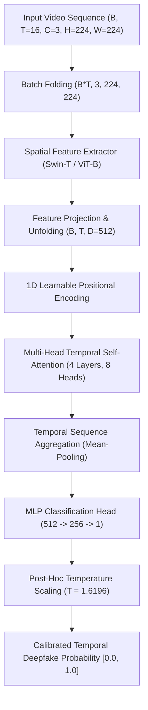

# 🏗️ TruthLens AI — Temporal Model Architecture Specification

## 1. Architectural Overview

The TruthLens Temporal AI model is engineered specifically for **inter-frame anomaly detection, optical flow consistency, and sequence-level manipulation forensics**. Unlike standard single-frame deepfake detectors, this model processes temporal sequences $(T=16)$ to detect blending flicker, boundary warping, inter-frame landmark jitter, and unnatural facial motion dynamics.

---

## 2. Layer-by-Layer Specifications & Tensor Shapes

| Stage | Operation / Layer | Input Tensor Shape | Output Tensor Shape | Parameters / Details |
|---|---|---|---|---|
| **1. Input** | Video Batch Sequence | $(B, T, C, H, W)$ | $(B, 16, 3, 224, 224)$ | Dynamic sliding stride $S \in [1, 4]$ |
| **2. Batch Fold** | Reshape for 2D Extractor | $(B, 16, 3, 224, 224)$ | $(B \cdot 16, 3, 224, 224)$ | Merges batch & sequence dims |
| **3. Spatial Extractor** | Swin Transformer Tiny (`swin_tiny`) | $(B \cdot 16, 3, 224, 224)$ | $(B \cdot 16, 768)$ | Pretrained ImageNet weights |
| **4. Feature Unfold** | Projection + Unfold | $(B \cdot 16, 768)$ | $(B, 16, 512)$ | Linear $(768 \to 512)$ + LayerNorm |
| **5. Positional Encoding** | Learnable 1D Temporal Embedding | $(B, 16, 512)$ | $(B, 16, 512)$ | Captures relative frame order |
| **6. Temporal Attention** | Transformer Encoder (4 Layers) | $(B, 16, 512)$ | $(B, 16, 512)$ | 8 heads, $d_{ff}=2048$, GELU, Dropout 0.2 |
| **7. Sequence Pool** | Temporal Mean-Pooling | $(B, 16, 512)$ | $(B, 512)$ | Aggregates global sequence context |
| **8. Classifier** | Multi-Layer Perceptron Head | $(B, 512)$ | $(B, 1)$ | Linear $(512 \to 256 \to 1)$ + LayerNorm |
| **9. Calibration** | Post-Hoc Temperature Scaling | $(B, 1)$ | $(B, 1)$ | $z_{\text{cal}} = z / 1.6196$, Sigmoid $\sigma(z_{\text{cal}})$ |

---

## 3. Subsystem Forensic Modules

### 3A. Temporal Transformer Model (`models/temporal_model.py`)
* **Purpose**: Primary sequence-level detector capturing long-range inter-frame dependencies.
* **Key Mechanism**: Multi-head self-attention enables every frame $t$ to compute attention scores against all other frames $t'$, identifying rapid phase shifts, blending artifacts, and temporal texture inconsistencies.

### 3B. Audio-Visual Lip Synchrony Module (`models/av_sync_model.py`)
* **Purpose**: Person 2B forensic module detecting desynchronization between lip movements and speech audio.
* **Mechanism**:
  - Visual Stream: Mouth ROI sequence processed through 3D convolutional frontend $(B, 1, 16, 88, 88) \to (B, 16, 256)$.
  - Audio Stream: 80-band Mel-spectrogram processed via 1D ResNet $\to (B, 16, 256)$.
  - Cross-Modal Attention: Computes Pearson cross-correlation and temporal offset $(\Delta t \text{ ms})$ between speech phonemes and visemes.

### 3C. Object Temporal Consistency Module (`models/object_temporal_model.py`)
* **Purpose**: Detects bounding box jitter, identity warping, and trajectory discontinuities across video frames.
* **Mechanism**: Computes instantaneous velocity vectors $v_t = \mathbf{p}_{t} - \mathbf{p}_{t-1}$ and acceleration vectors $a_t = v_t - v_{t-1}$. Unnatural spikes in landmark acceleration trigger high discontinuity scores.

### 3D. Calibrated Multi-Evidence Fusion (`models/fusion_model.py`)
* **Purpose**: Integrates visual temporal scores, AV-sync offsets, and object trajectory anomalies into a single calibrated risk assessment score.
* **Equation**:
  $$\text{Risk}_{\text{Final}} = \alpha \cdot \hat{p}_{\text{temporal}} + \beta \cdot \hat{p}_{\text{av\_sync}} + \gamma \cdot \hat{p}_{\text{object}}$$
  where $\alpha=0.60, \beta=0.25, \gamma=0.15$.

---

## 4. Confidence Calibration (Temperature Scaling)

Deep neural networks are often overconfident in out-of-domain scenarios. The model applies **Post-Hoc Temperature Scaling** on validation set logits:
$$\hat{p} = \sigma\left(\frac{z}{T}\right)$$
* **Trained Parameter**: $T = 1.619594$
* **Validation Expected Calibration Error (ECE)**: `0.1632`
* **In-Domain Test ECE**: `0.0643` (well-calibrated confidence intervals).
